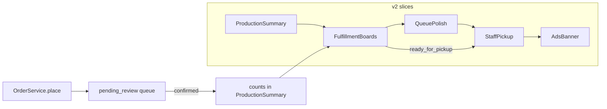

# Implementation Plan: Freshy Booking v2

> v1 เสร็จและรับมอบแล้ว — แผน v1 เก็บไว้ที่ `tasks/archive/v1-plan.md`

อ้างอิง: `docs/intent/v2.md` · `docs/intent/admin-redesign.md` · `docs/intent/ads-banner.md` · `docs/srs.md`

## Overview

v2 คืองาน ops หลัง v1 ตาม intent ที่ยืนยันใน grill: เจ้าหน้าที่สรุปยอดสั่งโรงงานได้ → เคลียร์ของตามช่องทางรับ/ส่ง → คิวตรวจสลิปยังลื่น → รับของหน้างานเร็ว → แบนเนอร์หน้าร้านจัดการได้

ลำดับบังคับ: **Production summary → Fulfillment → Queue redesign → Pickup → Ads**

## Architecture decisions

| การตัดสินใจ | ค่าที่ล็อก | เหตุผลสั้นๆ |
| --- | --- | --- |
| Stack | Livewire admin + `app/Services` + `app/Contracts` เดิม — ไม่ย้าย Filament | ตาม `.ai/rules/admin.md` และ ADR-002 |
| กฎออเดอร์ | ไม่เปลี่ยนกฎ transition ใน `OrderService` | v2 = UI / query / aggregation ใหม่เท่านั้น |
| Production counts | นับเฉพาะสถานะหลังยืนยันสลิป: `confirmed`, `ready_for_pickup`, `shipped`, `completed` (ตัด `pending_review`, `need_reslip`, `cancelled`) | ยอดสั่งผลิตต้องมาจากออเดอร์ที่จ่ายจริงแล้ว |
| ฟิลเตอร์สรุปยอด | `booking_round_id` + `faculty` (จาก `orders.faculty`; ค่าเริ่มต้น = ทุกคณะ) | ตามที่ยืนยันเพิ่มระหว่าง grill |
| Aggregation | จาก `order_items` — แต่ละ `choices[]` `{label,value}` นับ `+qty` ของบรรทัด (bundle นับทีละชิ้นตาม label เช่น `เสื้อ · ไซส์`) | ไม่มีตารางรายงานแยก ไม่ reconstruct catalog tree |
| Export | CSV สตรีมในแอป; Excel ผ่าน `openspout/openspout`; PDF ผ่าน `barryvdh/laravel-dompdf` | สองแพ็กเกจนี้อนุมัติมาพร้อมแผน; export ใช้ผลจาก `ProductionSummaryService` ไม่คำนวณคนละสูตร |
| Fulfillment UI | คิวแยกตาม `FulfillmentMethod` (`bookstore` / `hall` / `post`) สำหรับงานหลัง confirm — ใช้ `transition` / `markPickedUp` / `issueReceipt` ที่มีอยู่ | ไม่มีเลขพัสดุ / พิมพ์ / ขนส่ง |
| Queue redesign | คิวสลิป workspace ใน `Orders\Index` มีอยู่แล้ว — เฟสนี้เป็น audit + ปิดช่องว่าง | อย่า rebuild หรือ duplicate workspace |
| Pickup | หน้าค้นหารหัสออเดอร์/รหัสนักศึกษา → รายการ+ไซส์+จุดรับ → รับครบ/ใบเสร็จ | ไม่มี claim lock / สแกนฮาร์ดแวร์ / จอคิว |
| Ads | CRUD แบนเนอร์ + carousel หน้าแรก ตาม `docs/intent/ads-banner.md` | ไม่มีแบนเนอร์ active → ซ่อนช่อง |

---

## Task List

### Phase 0 — Intent + plan files

#### Task 0: บันทึก intent v2 + แทนที่ไฟล์แผน

**Description:** เขียน `docs/intent/v2.md` จาก restate ที่ยืนยันใน grill และแทนที่ `tasks/plan.md` / `tasks/todo.md` ด้วยแผน v2 (ย้าย v1 ไป `tasks/archive/` เพราะโปรเจกต์ยังไม่มี git history)

**Acceptance criteria:**

- [x] `docs/intent/v2.md` มี confirmed statement + decisions + non-goals ตามรูปแบบ intent เดิม
- [x] `tasks/plan.md` / `tasks/todo.md` เป็นเนื้อหา v2 ทั้งไฟล์
- [x] v1 ยังอ่านได้ที่ `tasks/archive/v1-plan.md` และ `tasks/archive/v1-todo.md`

**Verification:** อ่านไฟล์เทียบกับ restate ที่ผู้ใช้ตอบ Yes
**Dependencies:** None
**Scope:** S

### Phase 1 — Production summary

#### Task 1: `ProductionSummaryService`

**Description:** service รวมยอดจาก `order_items` ของออเดอร์ที่ยืนยันสลิปแล้ว กรองตามรอบจอง + คณะ (optional) คืนแถวสินค้า × ตัวเลือก × จำนวน

**Acceptance criteria:**

- [x] นับเฉพาะ `confirmed`, `ready_for_pickup`, `shipped`, `completed`
- [x] กรองตาม `booking_round_id` และตาม `faculty` (ไม่ระบุ = ทุกคณะ)
- [x] แต่ละ `choices[]` `{label,value}` บวก `qty` ของบรรทัดนั้น; bundle นับแยกทีละ label
- [x] ผลลัพธ์เรียงคงที่ (สินค้า → label → value) เพื่อให้ export ตรงกับตาราง

**Verification:** unit/feature test ด้วย factory + seed ปี 70
**Dependencies:** Task 0
**Scope:** M

#### Task 2: Admin production summary + export CSV/PDF/Excel

**Description:** Livewire แอดมินแสดงตารางสรุปพร้อมฟิลเตอร์รอบจอง + คณะ, ลิงก์ใน nav, และปุ่มดาวน์โหลดสามรูปแบบจากชุดข้อมูลเดียวกับที่เห็นบนจอ

**Acceptance criteria:**

- [x] เปลี่ยนฟิลเตอร์แล้วตารางอัปเดตตาม
- [x] ดาวน์โหลด CSV / PDF / Excel ได้ และแถวหลักตรงกับตารางบนจอตามฟิลเตอร์เดียวกัน
- [x] ภาษาไทยไม่เพี้ยนทั้งสามไฟล์ (CSV UTF-8 BOM, PDF ใช้ฟอนต์ที่รองรับไทย)
- [x] เข้าถึงได้จาก nav แอดมินเดียวกับโมดูลอื่น

**Verification:** feature test สามรูปแบบคืน 200 + มีแถวที่คาด; ลองมือหนึ่งรอบ
**Dependencies:** Task 1
**Scope:** M

### Checkpoint A

- [x] เลือกรอบจอง / คณะแล้วเห็นตารางยอด + ดาวน์โหลด CSV, PDF, Excel ตรงกับออเดอร์ทดสอบ

---

### Phase 2 — Fulfillment

#### Task 3: คิว fulfillment ตามช่องทาง

**Description:** มุมมองงานหลัง confirm แยกตาม `bookstore` / `hall` / `post` พร้อม action ที่พาออเดอร์ไปจนจบผ่าน `OrderService` เดิม

**Acceptance criteria:**

- [x] สลับช่องทางแล้วเห็นเฉพาะออเดอร์ของช่องทางนั้น
- [x] ทำ พร้อมรับ / ส่งแล้ว / รับครบ+ใบเสร็จ ได้จากมุมมองนี้
- [x] ไม่มีเลขพัสดุ / พิมพ์ / ขนส่ง

**Verification:** feature test ต่อช่องทาง + ต่อ transition
**Dependencies:** Task 2
**Scope:** M

#### Task 4: ทดสอบ + polish ลูปหลังคิวสลิป

**Description:** ปรับ detail/actions ให้เคลียร์งานต่อเนื่องได้ลื่นโดยไม่แตะกฎ transition

**Acceptance criteria:**

- [x] เทสต์ครอบ transition ที่อนุญาต/ไม่อนุญาตจากมุมมอง fulfillment
- [x] ทำงานได้บนจอมือถือ/แล็ปท็อป

**Verification:** `php artisan test --compact` เฉพาะไฟล์ที่เกี่ยว
**Dependencies:** Task 3
**Scope:** S

### Checkpoint B

- [x] แอดมินเคลียร์ออเดอร์ `confirmed` ตามช่องทางจน `completed` ได้โดยไม่ต้องกลับไปคิว `pending_review`

---

### Phase 3 — Queue redesign (gap-fill)

#### Task 5: Audit คิวสลิปเทียบ admin-redesign intent

**Description:** เทียบ workspace ที่มี (list+detail, hotkeys, auto-advance) กับ `docs/intent/admin-redesign.md` แล้วปิดเฉพาะช่องว่างที่ยังเจ็บ

**Acceptance criteria:**

- [x] มีรายการช่องว่างที่พบ (หรือบันทึกว่าไม่มี)
- [x] ช่องว่างที่ปิดมีเทสต์หรือการตรวจด้วยมือกำกับ
- [x] ไม่ deep-CRUD, ไม่ rebuild workspace ใหม่

**Verification:** เทสต์คิวเดิมยังผ่าน + ตรวจตาม intent ทีละข้อ
**Dependencies:** Task 4
**Scope:** S

#### Task 6: Shell/nav เดียวครอบทุกโมดูล ops

**Description:** ตรวจว่า Production / Fulfillment / Orders / Pickup ใช้ shell, nav, ธีมเดียวกัน และเตรียมช่องสำหรับ Ads

**Acceptance criteria:**

- [x] ทุกโมดูลเข้าถึงได้จาก nav เดียว และ active state ถูกต้อง
- [x] ไม่มีหน้าไหนหลุดธีมจนรู้สึกคนละระบบ

**Verification:** ตรวจด้วยมือ + smoke test หน้าแอดมิน
**Dependencies:** Task 5
**Scope:** S

### Checkpoint C

- [x] ลูป approve/reject ต่อเนื่องยังผ่านเทสต์เดิม และช่องว่างตาม intent ถูกปิดหรือบันทึกว่าไม่มี

---

### Phase 4 — Staff pickup

#### Task 7: หน้า Pickup assist สำหรับเจ้าหน้าที่

**Description:** ค้นด้วยรหัสออเดอร์/รหัสนักศึกษา → เห็นรายการ+ไซส์+จุดรับ → รับครบ + ใบเสร็จผ่าน `OrderService`

**Acceptance criteria:**

- [x] ค้นเจอจากรหัสออเดอร์หรือรหัสนักศึกษา
- [x] เห็นรายการสินค้า ตัวเลือก/ไซส์ และจุดรับของออเดอร์นั้น
- [x] `markPickedUp` + ใบเสร็จทำได้จากหน้านี้
- [x] ไม่มี claim lock / สแกนฮาร์ดแวร์ / จอคิว

**Verification:** feature test ค้นหา + mark picked up
**Dependencies:** Task 6
**Scope:** M

#### Task 8: Feature tests pickup

**Description:** ครอบเคสค้นหาไม่เจอ, ออเดอร์สถานะไม่พร้อมรับ, และรับครบสำเร็จ — ไม่รวม student checklist mockup

**Acceptance criteria:**

- [x] เทสต์ครอบ happy path + สถานะที่ไม่อนุญาต
- [x] ไม่มีโค้ดฝั่งนักศึกษาเพิ่มในเฟสนี้

**Verification:** `php artisan test --compact --filter=Pickup`
**Dependencies:** Task 7
**Scope:** S

### Checkpoint D

- [x] รับของหน้างานด้วยมือถือ/แล็ปท็อปได้จากรหัสออเดอร์หรือรหัสนักศึกษา

---

### Phase 5 — Ads banner

#### Task 9: โมเดล + service + admin CRUD แบนเนอร์

**Description:** migration/model `ads_banners` (รูป, URL, ลำดับ, active), `AdsBannerService`, และ CRUD แอดมินสำหรับเพิ่ม/เรียง/เปิด-ปิด

**Acceptance criteria:**

- [x] อัปโหลดรูป + วาง URL + เรียงลำดับ + เปิด/ปิดได้
- [x] Query แบนเนอร์ active เรียงตามลำดับผ่าน service

**Verification:** feature test CRUD + ordering
**Dependencies:** Task 8
**Scope:** M

#### Task 10: Carousel หน้าแรก

**Description:** ช่อง `home-banner` บนหน้าแรกเลื่อนแบบ Shopee; แตะแล้วเปิด URL นอก

**Acceptance criteria:**

- [x] มีแบนเนอร์ active → เลื่อนได้บนหน้าแรก
- [x] ไม่มีแบนเนอร์ active → ซ่อนช่อง ไม่เหลือกล่องว่าง
- [x] แตะแล้วออกไป URL ที่ตั้งไว้

**Verification:** feature test หน้าแรกกรณีมี/ไม่มีแบนเนอร์
**Dependencies:** Task 9
**Scope:** S

### Checkpoint E — v2 complete

- [x] ครบห้าสไลซ์ตาม success ใน `docs/intent/v2.md`
- [x] ของนอกขอบเขตยังไม่เริ่ม

---

## Risks and mitigations

| Risk | Impact | Mitigation |
| --- | --- | --- |
| Bundle choices เป็น label string ไม่มี FK ชิ้นส่วน | กลาง | ล็อกรูปแบบ aggregation จาก `choices` ที่มี; เทสต์ด้วย seed ปี 70; ไม่พยายาม reconstruct catalog tree |
| คิวสลิปถูก redesign ไปแล้วบางส่วน | ต่ำ | Task 5 เป็น audit-first; อย่า duplicate workspace |
| Fulfillment กับ Pickup ซ้อน UI | กลาง | Fulfillment = คิวตามช่องทางทั้งชุดสถานะหลัง confirm; Pickup = ค้นหาเร็วหน้างานอย่างเดียว |
| ภาษาไทยใน export / ฟอนต์ PDF | กลาง | CSV UTF-8 BOM; Excel ผ่าน OpenSpout; PDF ใช้ฟอนต์ที่รองรับไทยใน Dompdf view; เทสต์ว่าทั้งสามรูปแบบคืน 200 และแถวหลักตรงกัน |

## Out of scope (ชัด)

เลขพัสดุ, พิมพ์ใบปะหน้า, packing list, API โรงงาน/PO อัตโนมัติ, แจ้งเตือน LINE/SMS, slip verifier จริง, QR PromptPay dynamic, student pickup checklist, Filament, roles หลายระดับ, auto-verify แทนคน, เปลี่ยนกฎสต็อก

## Files likely touched (โดยเฟส)

- Phase 1: `app/Services/Production/`, `app/Livewire/Admin/ProductionSummary/`, export actions (CSV/PDF/Excel), Blade PDF view, composer deps `openspout/openspout` + `barryvdh/laravel-dompdf`, `resources/views/components/admin/header.blade.php`, tests ใหม่
- Phase 2: `app/Livewire/Admin/Fulfillment/` (หรือขยาย Orders + filter mode), views, `tests/Feature/Admin*Test.php`
- Phase 3: `app/Livewire/Admin/Orders/Index.php` + admin shell เท่าที่ audit ชี้
- Phase 4: `app/Livewire/Admin/Pickup/`, reuse `OrderService`
- Phase 5: migration + model `AdsBanner` + `AdsBannerService` + admin CRUD + storefront home Blade

## ลำดับแนะนำ (sequential default)

`0 → 1 → 2 → 3 → 4 → 5 → 6 → 7 → 8 → 9 → 10`
