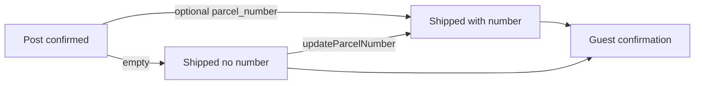

# Implementation Plan: เลขพัสดุไปรษณีย์ (v3 slice)

> แผน mockup แอดมินที่ปิดแล้วอยู่ที่ `tasks/archive/admin-console-mockup-plan.md`
> v2 ยังปิดอยู่ที่ `tasks/archive/v2-plan.md` — ไม่เปิดโปรแกรม v3

อ้างอิง: `docs/intent/v3-post-parcel.md` · `docs/intent/v2.md` · `docs/srs.md` · `.ai/rules/admin.md` · `.ai/rules/admin-toast.md`

## Overview

แอดมินบันทึกเลขพัสดุ (optional, ข้อความว่าง) ตอนกดจัดส่งแล้วบนแท็บไปรษณีย์ แล้วแก้ย้อนหลังได้บนออเดอร์ shipped นักศึกษาเห็นเลขนั้นบนหน้าติดตามที่มีสามขั้นและจบที่ shipped

## Architecture decisions

- คอลัมน์ใหม่ `orders.parcel_number` (string, nullable) — ห้ามใช้ซ้ำ `tracking_token` (ลิงก์ดูออเดอร์)
- ค่าว่าง / ล้างช่อง เก็บ `null` ไม่มี regex รูปแบบ
- `OrderService::transition()` คงเป็น status-only
- `markShipped(Order, User, ?string $parcelNumber)` — post + `Confirmed` → `Shipped` ตั้งเลขในทรานแซกชันเดียว
- `updateParcelNumber(Order, User, ?string $parcelNumber)` — post + `Shipped` เท่านั้น (shipped คือจบงาน ไม่มี UI completed)
- ไม่มี reverse transition และไม่มาร์ค post เป็น completed ในสไลซ์นี้
- คิว “รอดำเนินการ” แยกตามช่องทาง: bookstore/hall = `confirmed`; post = `confirmed` + `shipped` ที่ `parcel_number` เป็น null
- ช่องเลขอยู่แผงรายละเอียดหน้าจัดส่ง (ไม่ไดอะล็อกครั้งเดียว) — unlabeled + `aria-label` ตามกฎแอดมิน
- หน้า confirmation ของ post: จองแล้ว → ตรวจสลิป → จัดส่งแล้ว; pickup ไม่เปลี่ยน

## Task List

### Phase 0 — Intent + plan files

#### Task 0: บันทึก intent + แทนที่ไฟล์แผน

**Description:** เขียน `docs/intent/v3-post-parcel.md` จาก restate ที่ยืนยัน ย้ายแผน mockup ไป `tasks/archive/` แล้วแทนที่ `tasks/plan.md` / `tasks/todo.md`

**Acceptance criteria:**

- [x] intent มี confirmed statement + decisions + non-goals
- [x] ไฟล์แผนเป็นเนื้อหาเลขพัสดุทั้งไฟล์
- [x] mockup ยังอ่านได้ที่ `tasks/archive/admin-console-mockup-plan.md` และ `tasks/archive/admin-console-mockup-todo.md`

**Verification:** อ่านไฟล์เทียบกับ restate ที่ผู้ใช้ตอบ Yes
**Dependencies:** None
**Scope:** S

### Phase 1 — Domain

#### Task 1: schema + `OrderService::markShipped` / `updateParcelNumber`

**Description:** migration เพิ่ม `orders.parcel_number` (nullable string); fillable/factory; `OrderService::markShipped` สำหรับ post+confirmed (ตั้งเลขในทรานแซกชันเดียวกับสถานะ) และ `updateParcelNumber` สำหรับ post+shipped; ค่าว่างเป็น `null`; `transition()` ไม่รับเลขพัสดุ

**Acceptance criteria:**

- [x] คอลัมน์ `parcel_number` มีใน `orders` คนละตัวกับ `tracking_token`
- [x] ส่งได้ทั้งมีเลขและไม่มีเลข; ค่าว่างเก็บ `null`
- [x] ปฏิเสธเลขบน bookstore/hall; อัปเดต/ล้างได้หลัง shipped; ข้ามไป `ready_for_pickup` จาก post ไม่ได้
- [x] factory สร้างออเดอร์ได้โดยไม่บังคับเลข

**Verification:** `php artisan test --compact tests/Feature/OrderAdminServiceTest.php`
**Dependencies:** Task 0
**Scope:** M
**Files likely touched:** `database/migrations/*_add_parcel_number_to_orders_table.php`, `app/Models/Order.php`, `database/factories/OrderFactory.php`, `app/Services/Order/OrderService.php`, `tests/Feature/OrderAdminServiceTest.php`

### Phase 2 — Admin fulfillment

#### Task 2: คิว post + ช่องเลขพัสดุบนหน้าจัดส่ง

**Description:** ปรับ `pages::admin.fulfillment` ให้รอดำเนินการของ post รวม shipped ที่ยังไม่มีเลข; แผงรายละเอียดมีช่อง unlabeled + `aria-label` เลขพัสดุ; confirmed กดจัดส่งแล้วผ่าน `markShipped`; shipped กดบันทึกเลขพัสดุผ่าน `updateParcelNumber`; toast ผ่าน `admin-toast` ข้อผิดพลาดอยู่ inline; หน้า `order-detail` แสดงเลขแบบอ่านอย่างเดียวสำหรับ post (แก้ที่หน้าจัดส่ง)

**Acceptance criteria:**

- [x] คิวรอดำเนินการ post = confirmed + shipped ที่ `parcel_number` null; bookstore/hall ยังเป็น confirmed
- [x] ล้างเลขแล้วออเดอร์กลับเข้าคิวรอดำเนินการของ post
- [x] `markShipped` บันทึกเลข; อัปเดตบน shipped ได้; ไม่มีปุ่มปิด completed สำหรับ post
- [x] หน้า order-detail โชว์เลขพัสดุของ post (read-only)

**Verification:** `php artisan test --compact tests/Feature/AdminPickupTest.php`
**Dependencies:** Task 1
**Scope:** M
**Files likely touched:** `resources/views/pages/admin/fulfillment.blade.php`, `resources/views/pages/admin/order-detail.blade.php`, `tests/Feature/AdminPickupTest.php`

### Phase 3 — Guest confirmation

#### Task 3: ไทม์ไลน์ post + แสดง/คัดลอกเลขพัสดุ

**Description:** `trackingSteps()` แยกตาม fulfillment — pickup คง จองแล้ว → ตรวจสลิป → พร้อมรับ → รับแล้ว; post เป็น จองแล้ว → ตรวจสลิป → จัดส่งแล้ว และ `Shipped` (รวม `Completed` ถ้ามี) = จบทุกขั้น; โชว์เลขพัสดุเมื่อมี คัดลอกแบบรหัสออเดอร์ (`x-storefront` + clipboard); ไม่ใส่ URL ผู้ขนส่ง; ข้อความใบเสร็จตอนรับสินค้าไม่ใช้กับออเดอร์ post

**Acceptance criteria:**

- [x] confirmation ของ post มีสามขั้นและจบที่ shipped
- [x] pickup ยังสี่ขั้นตามเดิม
- [x] เลขพัสดุโชว์และคัดลอกได้เมื่อมีค่า; ไม่โชว์เมื่อเป็น null
- [x] ข้อความสัญญาใบเสร็จตอนรับสินค้าไม่ขึ้นกับออเดอร์ post

**Verification:** `php artisan test --compact tests/Feature/GuestOrderTrackingTest.php`
**Dependencies:** Task 1
**Scope:** M
**Files likely touched:** `resources/views/pages/storefront/order-confirmation.blade.php`, `tests/Feature/GuestOrderTrackingTest.php`

### Phase 4 — Tests + pint

#### Task 4: เทสต์ครบชุดที่แตะ + pint

**Description:** เติมเคสที่ยังไม่ครอบในไฟล์เทสต์ที่เกี่ยว แล้วรันเฉพาะไฟล์นั้น จากนั้นจัดรูปแบบ PHP ที่แก้

**Acceptance criteria:**

- [x] service: ส่งมี/ไม่มีเลข; ปฏิเสธเลขบน bookstore; อัปเดต/ล้างหลังส่ง; ข้ามไป ready_for_pickup ไม่ได้
- [x] Livewire fulfillment: สมาชิกคิว active ของ post; `markShipped` เก็บเลข; อัปเดตบน shipped
- [x] guest confirmation: ขั้น post + เลขโชว์; ขั้น pickup ไม่เปลี่ยน
- [x] pint ผ่านบนไฟล์ที่แก้

**Verification:** `php artisan test --compact tests/Feature/OrderAdminServiceTest.php tests/Feature/AdminPickupTest.php tests/Feature/GuestOrderTrackingTest.php` แล้ว `vendor/bin/pint --dirty --format agent`
**Dependencies:** Task 1, Task 2, Task 3
**Scope:** S

## Out of scope

ใบปะหน้า/พิมพ์/packing list, เชื่อมขนส่ง, URL ผู้ขนส่ง, LINE/SMS, verifier, roles, API โรงงาน, เช็คลิสต์นักศึกษา, รวมหน้าจัดส่งกับรับของ, ปุ่มปิด completed สำหรับ post, เปลี่ยนกฎ pickup / bookstore / hall, Filament

## ลำดับแนะนำ

`0 → 1 → 2 → 3 → 4` (Task 2 กับ Task 3 ทำคู่ขนานได้หลัง Task 1)
